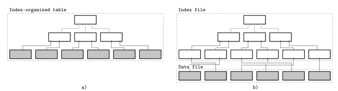
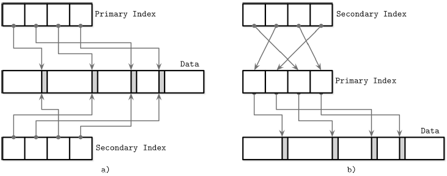

# Overview

## Data Files and Index Files

### Data Files

### Index Files

- Primary index files hold a unique entry per search key
- Secondary indexes may hold several entries per search key 
- Clustered index: order of data records follows the search key order.
- Nonclustered index: order of data records doesn't follow the key order

### Primary Index as an Indirection

2 approaches:
- 2 indexes reference data entries directly
- A secondary index goes throught the indirection layer of primary index to locate the data entries

## Buffering, Immutability, and Ordering

### Buffering

### Immutability
- Mutable: update in-place (B-Tree)
- Immutable: append-only, copy-on-write (LSM)

### Ordering
- Whether or not the data records are stored in the key order in the pages on disk.
- IOW, the keys that sort closely are stored in contiguous segments on disk.

# C.2 B-Tree basics

## Binary Search Trees
### Tree Balancing
- Keep height of logN
### Trees for Disk-Based Storage
- A version of the tree that would be better suited for disk implementation has to exhibit the properties:
 + High fanout: improve locality of the neighboring keys.
 + Low height: reduct the number of seeks during traversal.
- Pages binary trees
## Disk-Based Structures
Data structures used in DB have to be adapted to account for persistent medium limitations.
### Hard Disk Drives
- Disk rotation, mechanical head movement, head positioning.
- Seeks increase costs of random reads
- Reading or writing contiguous bytes (sequential operations) is relatively cheap
- The smallest transfer unit is a sector
- Sequential I/O
### Solid State Drives
### On-Disk Structures

## Ubiquitous B-Trees
### B-Tree Hierachy
### Separator keys
### B-Tree lookup complexity
- 2 standpoints:
 + no. block transfers
 + no. comparison
### B-Tree Lookup Algorithm
### Counting Keys
### B-Tree Node splits
### B-Tree Node Merges
- (?) When spliting/merging, do nodes need to be moved in Disk? i.e: insert a leaf node in between

# C.3 File Formats
- On-disk B-Trees as a page management mechanism: algorithms have to compose & navigate pages.
- In disk, to navigate everything, we need offset + length. That's why it's built by hierarchy: region -> section -> page -> cell -> field -> primitives
- Layout by page
## Motivation
## Binary Encoding
## General Principles
## Page structure
## Slotted Pages

## Cell Layout
## Combining Cells into Slotted Pages

## Manging Variable-Size Data

- B-Tree layout: 
 + node -> single page. Page -> (fixed-size header + cell pointer + cells)
 + cell -> key + pointer-> page (child node)/ data record
 + page ID -> child node in file, cell offset -> cell in page

## Rightmost pointers
- Store the rightmost child node (largest child node)

# C.4 Implement B-Trees
## Page Header
### Node High Keys
### Overflow Pages
- Accoring to the B-Tree algorithm, the node is not full yet, but there's no more free space on fixed-size page that holds this node.

## Binary Search