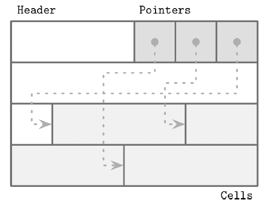
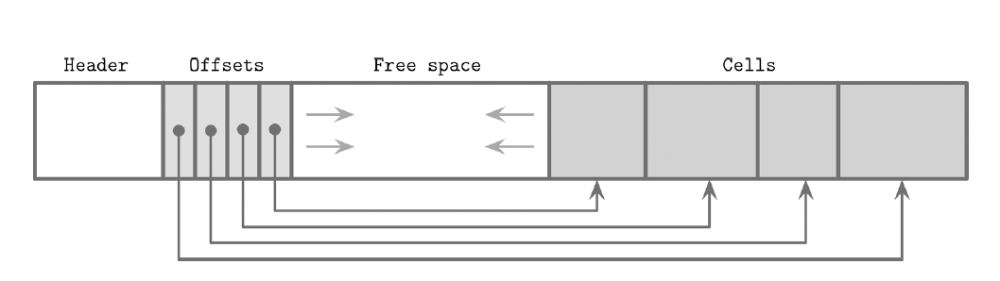

# C.3 File Formats
- On-disk B-Trees as a page management mechanism: algorithms have to compose & navigate pages.
- In disk, to navigate everything, we need offset + length. That's why it's built by hierarchy: region -> section -> page -> cell -> field -> primitives
- Layout by page
## Motivation
## Binary Encoding
## General Principles
## Page structure
## Slotted Pages

## Cell Layout
## Combining Cells into Slotted Pages

## Manging Variable-Size Data

- B-Tree layout: 
 + node -> single page. Page -> (fixed-size header + cell pointer + cells)
 + cell -> key + pointer-> page (child node)/ data record
 + page ID -> child node in file, cell offset -> cell in page

## Rightmost pointers
- Store the rightmost child node (largest child node)

# C.4 Implement B-Trees
## Page Header
### Node High Keys
### Overflow Pages
- Accoring to the B-Tree algorithm, the node is not full yet, but there's no more free space on fixed-size page that holds this node.

## Binary Search